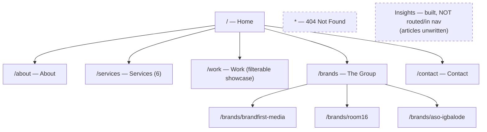
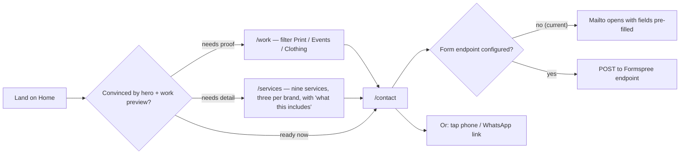
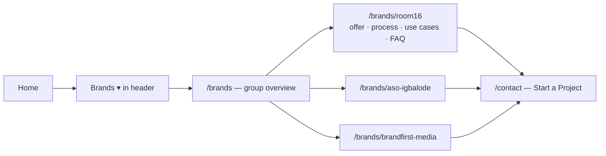

# 03 — App Flow: Sitemap, Navigation and Visitor Journeys

**Site:** Brandfirst Media (React build in `brandfirst-media/`)
Routes and nav are defined in `src/App.jsx` and `src/data/site.js` (`nav`).

> **Paths** in this document are relative to the parent project folder `BrandfirstMedia/`, which holds this repository (`brandfirst-media/`) alongside `wp-local/`, `arolax-theme/`, `room16-instagram/` and `media files/`. Those four are **not** in this repository.

---

## 1. Sitemap

## 2. Navigation structure

**Header (all pages, via `SiteLayout`):** Home · About · Services · Work · **Brands ▾** (Brandfirst Media / ROOM16 / Aṣọ Ìgbàlódé) · Contact — plus a "Get in touch" action button.

**Footer:** brand block + link columns (dark `#121212` footer, per the Arolax template), a contact block (shared `ContactLinks` component) — phone icon + 0708 413 7772, WhatsApp icon + 0806 6442508, envelope icon + info@brandfirstmedia.com, one per line with icons and text each on a shared left edge; the icons replace the old "Call:" / "WhatsApp:" labels and each link carries an aria-label with that meaning — and each brand's Instagram, copyright. A floating WhatsApp button sits bottom-right on every page (layered below the header, so an open mobile menu covers it).

Notes:

- Insights is deliberately absent from the nav: *"the page exists but its articles are still unwritten, and an empty journal advertises that nobody is minding it"* (comment in `site.js`). Add it the day the first pieces are published.
- Unknown URLs render the 404 template, never an empty page.
- Every service card carries a `brand` tag (`brandfirst` / `room16` / `aso-igbalode`) linking the service to the brand that delivers it.

## 3. Homepage section order

1. Hero — "Print. Events. Clothing." + Start a Project / See What We Do
2. Intro — "One Team From Artwork to Event Night"
3. Group strip — "One group, three brands"
4. Services — six cards
5. Why us — "Deadlines That Hold. Colour That Matches."
6. Industries — "Who We Produce For"
7. Work preview
8. CTA — "Ready to Put Your Brand First?"

Sections render as stacked, pinned, rounded cards (desktop only), per the Arolax demo behaviour documented in `SECTION-MAP.md`.

## 4. Key visitor journeys

### Journey A — Prospect with a job and a date (primary)

WhatsApp is called out in the code as how most Lagos SMB enquiries actually arrive — the contact page exposes phone, WhatsApp and email alongside the 7-field form (Name, Company, Email, Phone, Service interest, Budget range, Message).

### Journey B — Visitor evaluating a specific brand

Each brand detail page follows the same shape: hero image → offer table → 4-step process (Brief/Proof/Produce/Deliver or brand-specific equivalent) → use cases → FAQ → social links.

### Journey C — Diligence visitor (who are these people?)

Home → `/about` (overview, philosophy, mission/vision, five values) → `/work` (real production photos and video loops) → `/contact`.

## 5. WordPress reference sitemap (wp-local, for context only)

The local WordPress install carries the Arolax "Branding Agency" demo: Elementor homepage #9322 plus templates for blog archive/single, portfolio details, team, career, FAQ, search, taxonomy and 404. The React build reproduced all of these as templates during development, but the shipped app routes only the pages the Brandfirst content supports (see §1) — the demo's Team / Career / FAQ / Blog routes were dropped or absorbed (FAQ content now lives inside brand detail pages).
